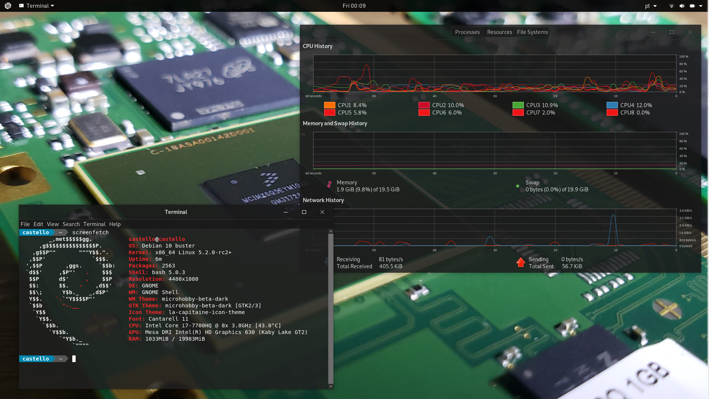

# Microhobby Transparent Transformation Pack

GTK theme based on the appearance of Windows 10 using a dark mode,
and an aggressive transparency.

**License :** GPL v3

**Based on:** [B00merang-Project/Windows-10-Dark](https://github.com/B00merang-Project/Windows-10-Dark)

For the moment, this theme works with the following Desktop environments : 
- GNOME-SHELL 3.14 and higher

### Manual installation

Extract the zip file to the themes directory i.e. `/home/USERNAME/.themes`

### Requirements

- GTK+ 3.6 or above
